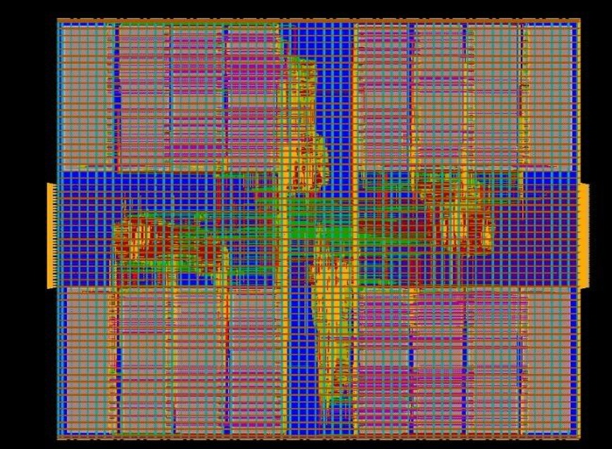

# ChipTop Design 

## Project Overview

This project demonstrates the ASIC Physical Design implementation of a ChipTop design using Cadence Innovus. The implementation involved floorplanning, macro placement, power planning, standard cell placement, Clock Tree Synthesis (CTS), routing, timing optimization, and physical verification to achieve a manufacturable layout.

---

## Tool Used

- Cadence Innovus
- Linux Environment

---

## Physical Design Flow

- Floorplanning
- Macro Placement
- Power Planning
- Placement
- Clock Tree Synthesis (CTS)
- Routing
- Timing Optimization
- Static Timing Analysis (STA)
- DRC Verification
- LVS Verification

---

## Final ChipTop Layout

---

## Results

- Successfully completed the complete ASIC Physical Design flow.
- Implemented macro-aware floorplanning and placement.
- Performed power planning and clock tree synthesis.
- Achieved successful routing with timing optimization.
- Verified the design using DRC and LVS checks.
- Generated the final GDSII-ready layout.

---

## Skills Demonstrated

- ASIC Physical Design
- Floorplanning
- Macro Placement
- Power Planning
- Standard Cell Placement
- Clock Tree Synthesis (CTS)
- Routing
- Timing Optimization
- Static Timing Analysis (STA)
- DRC & LVS Verification
- Cadence Innovus
